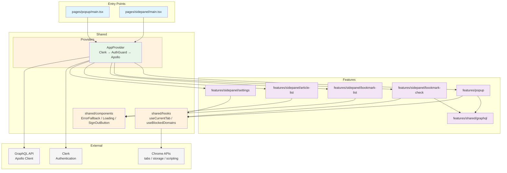

# Chrome Extension

## Development Setup

### Prerequisites
- Node.js (>=22)
- pnpm

### Installation
```bash
pnpm install
```

### Environment Variables

`.env.sample` を参考に `.env` ファイルを作成してください：

```bash
# .env
VITE_CLERK_PUBLISHABLE_KEY=pk_test_xxxxx
VITE_GRAPHQL_URI=http://localhost:3000/graphql
```

### Authentication

Clerk Chrome Extension SDK を使用してユーザー認証を行っています。

- `VITE_CLERK_PUBLISHABLE_KEY`: Clerk の Publishable Key
- `VITE_GRAPHQL_URI`: GraphQL API のエンドポイント URL

### Running Tests

```bash
pnpm test
```

テストでは MSW（Mock Service Worker）を使用して GraphQL API をモックしています。Clerk の認証もモックされるため、個別に認証設定は不要です。

### Available Scripts

- `pnpm dev` - Start development server（watch mode）
- `pnpm build` - Build for production
- `pnpm test` - Run tests
- `pnpm test:watch` - Run tests in watch mode
- `pnpm typecheck` - TypeScript type checking
- `pnpm lint` - Run ESLint
- `pnpm fmt` - Auto-fix lint issues
- `pnpm storybook` - Start Storybook dev server（port 6006）
- `pnpm vrt` - Run visual regression tests（Playwright）
- `pnpm vrt:dry-run` - Run VRT without snapshot comparison
- `pnpm vrt:html` - Run VRT with HTML reporter
- `pnpm vrt:approve` - Update VRT baseline snapshots

## Architecture

Chrome Manifest V3 に準拠したブラウザ拡張機能です。Popup と SidePanel の2つの UI エントリポイントを持ち、feature 単位でコードを整理しています。

### ディレクトリ構造

```
src/
  pages/                  # HTMLエントリポイント
    popup/                #   Popup (main.tsx, index.html)
    sidepanel/            #   SidePanel (main.tsx, index.html)
  features/               # 機能モジュール（ページ/タブ単位）
    popup/                #   Popup機能 (index.tsx, test.tsx, stories.tsx)
    sidepanel/            #   SidePanel機能（タブルーター）
      bookmark-check/     #     現在のページのブックマーク確認・編集
      bookmark-list/      #     ブックマーク一覧
      article-list/       #     Qiita記事一覧
      settings/           #     設定（ドメインブロックリスト）
    shared/graphql/       #   共有GraphQLクエリ/ミューテーション
  shared/                 # 共有モジュール
    components/           #   ErrorFallback, Loading, SignOutButton など
    hooks/                #   useCurrentTab, useBlockedDomains など
    providers/            #   AppProvider (Clerk → AuthGuard → Apollo)
  libs/                   # 技術基盤
    swr.ts                #   SWR設定
    test/                 #   Vitestセットアップ, MSWサーバー, Clerkモック
```

各 feature ディレクトリは `index.tsx`（コンポーネント）、`test.tsx`（テスト）、`stories.tsx`（Storybook）をコロケーションしています。GraphQL クエリ/ミューテーション定義やモックも同梱されます。

### UIエントリポイント

#### Popup

拡張機能のアクションボタンをクリックした際に表示されるポップアップ UI です。

- 現在のページのブックマーク状態を表示
- ワンクリックでブックマーク追加
- ドメインブロックリストによるフィルタリング

#### SidePanel

ドロワー形式のサイドパネル UI で、4つのタブで構成されています。

- **Current Page**（`BookmarkCheck`）— 現在のページのブックマーク確認・追加・編集
- **Bookmarks**（`BookmarkList`）— ブックマーク一覧表示・検索・削除
- **Articles**（`ArticleList`）— Qiita 記事一覧
- **Settings**（`Settings`）— ドメインブロックリスト管理

### 依存関係



### 設計の特徴

1. **Feature-based 構成**: ページ/タブ単位で機能をディレクトリ分割
2. **コロケーション**: コンポーネント・テスト・ストーリー・GraphQL 定義・モックを近くに配置
3. **React 19 Suspense**: データフェッチングに Suspense を活用し、ローディング状態を宣言的に管理
4. **Error Boundary**: 各タブに独立した Error Boundary を配置し、障害を局所化
5. **TypeScript 関数ベース**: アロー関数を使用したシンプルな実装
6. **type 定義**: `interface` ではなく `type` を使用（Biome ルール準拠）

## Chrome Extension

### Manifest V3

Chrome Manifest V3 に準拠。`public/manifest.json` で定義。

### Permissions

| Permission | 用途 |
|------------|------|
| `tabs` | アクティブタブ情報の取得 |
| `activeTab` | 現在のタブへのアクセス |
| `sidePanel` | サイドパネルの表示 |
| `scripting` | OG/meta タグ抽出（サムネイル取得） |
| `storage` | ドメインブロックリストの永続化 |
| `cookies` | Cookie の読み取り |

### Build Output

ビルド後の `dist/` ディレクトリが Chrome 拡張機能としてロード可能な構造になります。

## Testing

### Unit Tests

Vitest + Testing Library（jsdom 環境）を使用。

- テストファイルは `test.tsx` として各 feature に配置
- `@curio/testing-library` の `renderSuspense` ヘルパーで Suspense 対応テストを実行
- MSW で GraphQL API をモック
- Clerk 認証はセットアップファイルで自動モック

### Storybook

コンポーネント開発とビジュアル確認のための Storybook 環境。

- テーマ切り替え: `rosepine-dawn`（ライト）/ `rosepine-moon`（ダーク）
- MSW + `msw-storybook-addon` で API モック
- Clerk は `clerk-mock.tsx` でモック
- 幅 400px のコンテナで拡張機能のビューポートを再現

### Visual Regression Tests (VRT)

Playwright を使用した Storybook ベースのビジュアルリグレッションテスト。

- Storybook の全ストーリーを自動取得してスクリーンショット比較
- ベースラインスナップショットは `tests/vrt/__screenshots__/` に保存
- 許容差分: 100 ピクセル以内
