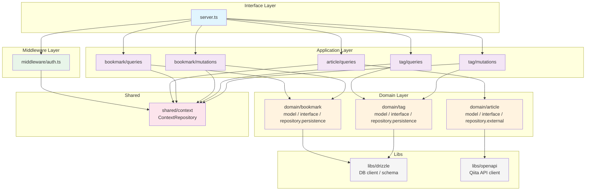

# GraphQL API Server

## Development Setup

### Prerequisites
- Node.js (>=22)
- pnpm

### Installation
```bash
pnpm install
```

### Database Setup

#### Development Database
```bash
# Start local SQLite dev database
pnpm db:local

# Generate Drizzle migrations
pnpm db:generate

# Run database migrations
pnpm db:migrate
```

### Authentication

このAPIは Clerk による認証を使用しています。すべてのGraphQLクエリとミューテーションには、有効な認証トークンが必要です。

#### 本番環境

本番環境では、`Authorization` ヘッダーに有効な Clerk JWT トークンを含める必要があります：

```
Authorization: Bearer <clerk-jwt-token>
```

#### 開発/テスト環境

開発環境（`NODE_ENV=development`）またはテスト環境（`NODE_ENV=test`）では、認証をバイパスできます。以下のヘッダーを含めることで、Clerk認証なしでAPIを使用できます：

```
X-Test-Key: <TEST_AUTH_KEY環境変数の値>
X-Test-User-Id: <任意のユーザーID>  # オプション（デフォルト: "test-user"）
```

**環境変数の設定例：**

```bash
# .env.local
NODE_ENV=development
TEST_AUTH_KEY=your-test-key
CLERK_SECRET_KEY=your-clerk-secret-key
```

**セキュリティ上の注意：**
- `TEST_AUTH_KEY` は本番環境では設定しないでください
- テストキー機能は `NODE_ENV=production` では動作しません

### Running Tests

```bash
pnpm test
```

テストでは、自動的に認証モックが適用されるため、個別に認証ヘッダーを設定する必要はありません。

### Available Scripts

- `pnpm dev` - Start development server
- `pnpm build` - Build for production
- `pnpm deploy` - Build and deploy to Cloudflare Workers
- `pnpm test` - Run tests
- `pnpm test:changed` - Run tests for files changed since main
- `pnpm typecheck` - TypeScript type checking
- `pnpm lint` - Run ESLint
- `pnpm codegen` - Build and generate GraphQL schema for client
- `pnpm db:local` - Start local SQLite dev database
- `pnpm db:push` - Push schema to database
- `pnpm db:generate` - Generate Drizzle migrations
- `pnpm db:migrate` - Run database migrations
- `pnpm db:studio` - Open Drizzle Studio UI
- `pnpm generate:openapi` - Generate types from Qiita OpenAPI spec
- `pnpm scaffold` - Code generation via scaffdog

## Architecture

本プロジェクトはClean Architectureの原則に従って設計されており、責務を明確に分離しています。

### ディレクトリ構造

```
src/
  server.ts             # GraphQLリゾルバー（エントリポイント）
  index.ts              # アプリケーションエントリポイント
  domain/               # ドメイン層（エンティティ単位で整理）
    {entity}/
      model.ts          #   エンティティ型定義
      interface.ts      #   リポジトリインターフェース
      repository.*.ts   #   リポジトリ実装 (persistence / external)
  application/          # アプリケーション層（ユースケース）
    {entity}/
      queries/          #   読み取りユースケース (e.g. get-bookmarks/)
      mutations/        #   書き込みユースケース (e.g. create-bookmark/)
  middleware/            # ミドルウェア層
    auth.ts             #   認証ミドルウェア (Clerk / テストキー)
  shared/               # 共有層
    context/            #   ContextRepository（ユーザーコンテキスト管理）
  libs/                 # 技術基盤ライブラリ
    drizzle/            #   DBクライアント, スキーマ定義, マイグレーション
    openapi/            #   Qiita APIクライアント
    test/               #   テストユーティリティ（認証ヘルパー, MSWモックサーバー等）
  generated/            # 自動生成コード (GQty, OpenAPI型定義)
```

各 query/mutation ディレクトリは `index.ts`（実装）と `test.ts`（テスト）をコロケーションしています。

### 依存関係



依存の方向: `domain` ← `application` ← `middleware` / `server.ts`

### 各層の責務

#### Domain Layer (`src/domain/`)
- **エンティティ定義**: 各ドメインオブジェクトの型定義 (`model.ts`)
- **リポジトリインターフェース**: データアクセスの抽象化 (`interface.ts`)
- **リポジトリ実装**: DB連携 (`repository.persistence.ts`) / 外部API連携 (`repository.external.ts`)
  - `article`: Qiita APIからの記事取得
  - `bookmark`: Drizzle ORMによるブックマークCRUD
  - `tag`: Drizzle ORMによるタグCRUD

#### Application Layer (`src/application/`)
- **ユースケース**: エンティティ単位（article, bookmark, tag）で整理
- 各query/mutationは独立したディレクトリで、`index.ts`（実装）と`test.ts`（テスト）を配置
- ドメイン層のリポジトリを利用してビジネスロジックを実装

#### Middleware Layer (`src/middleware/`)
- **認証ミドルウェア**: Clerk JWT検証 / テストキーバイパス
- `withAuth` HOFでリゾルバーをラップし、認証済みコンテキストを提供

#### Shared Layer (`src/shared/`)
- **ContextRepository**: Pylonの`getContext`を利用したユーザーコンテキスト管理（userId）

#### Libs (`src/libs/`)
- **drizzle**: DBクライアント・スキーマ定義・マイグレーション
- **openapi**: Qiita API型安全クライアント
- **test**: テストユーティリティ（認証ヘルパー、MSWモックサーバー等）

### 設計の特徴

1. **Clean Architecture**: domain / application / middleware / shared の明確な層分離
2. **エンティティ単位の整理**: application層・domain層ともにエンティティ単位でディレクトリを構成
3. **コロケーション**: 各query/mutationにテストファイルを同梱し、関連ファイルを近くに配置
4. **TypeScript関数ベース**: クラスではなくアロー関数を使用したシンプルな実装
5. **type定義**: `interface`ではなく`type`を使用（Biomeルール準拠）
6. **リポジトリパターン**: ドメイン層でインターフェースを定義し、永続化/外部API実装を同梱

## Database Schema

SQLite（本番: Turso、開発: ローカルSQLite）を使用。スキーマは Drizzle ORM で定義（`src/libs/drizzle/schema.ts`）。

### bookmarks
| Column | Type | Constraints |
|--------|------|-------------|
| id | TEXT | PRIMARY KEY (cuid2) |
| user_id | TEXT | NOT NULL |
| title | TEXT | NOT NULL |
| url | TEXT | NOT NULL |
| description | TEXT | |
| note | TEXT | |
| thumbnail | TEXT | |
| created_at | TEXT | NOT NULL, DEFAULT datetime('now') |
| updated_at | TEXT | NOT NULL, DEFAULT datetime('now') |

UNIQUE制約: `(user_id, url)`

### tags
| Column | Type | Constraints |
|--------|------|-------------|
| id | TEXT | PRIMARY KEY (cuid2) |
| user_id | TEXT | NOT NULL |
| name | TEXT | NOT NULL |
| created_at | TEXT | NOT NULL, DEFAULT datetime('now') |
| updated_at | TEXT | NOT NULL, DEFAULT datetime('now') |

UNIQUE制約: `(user_id, name)`

### bookmark_tags
| Column | Type | Constraints |
|--------|------|-------------|
| bookmark_id | TEXT | NOT NULL, FK → bookmarks.id (CASCADE DELETE) |
| tag_id | TEXT | NOT NULL, FK → tags.id (CASCADE DELETE) |

PRIMARY KEY: `(bookmark_id, tag_id)`
